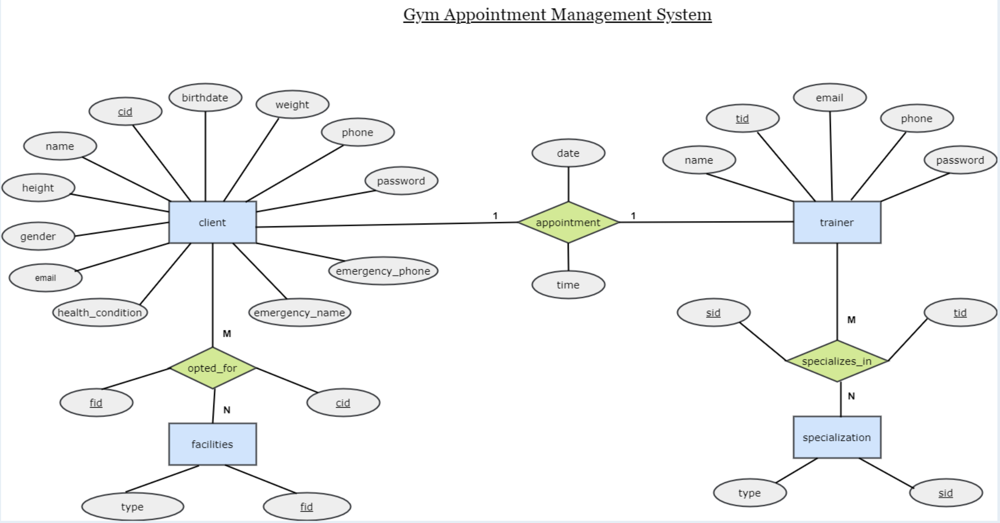
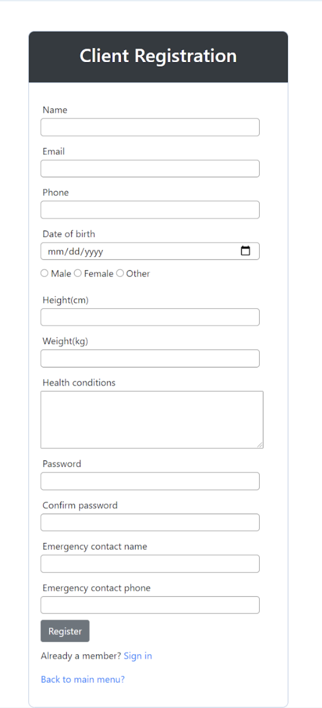
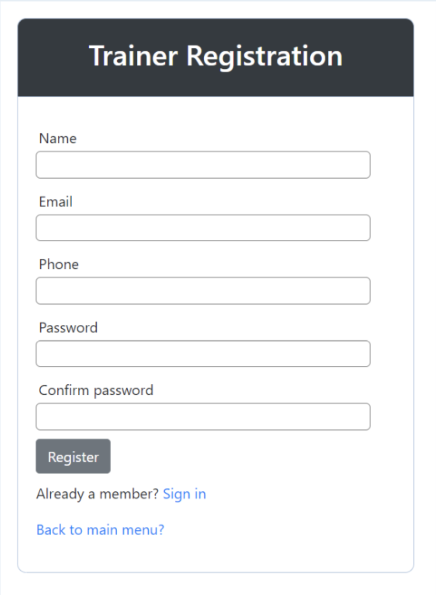
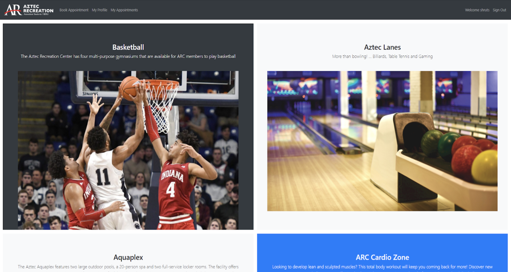
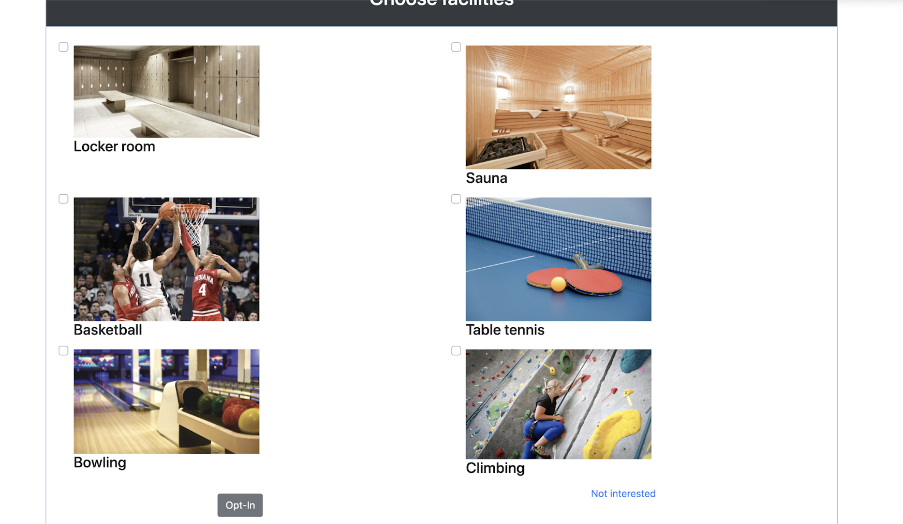
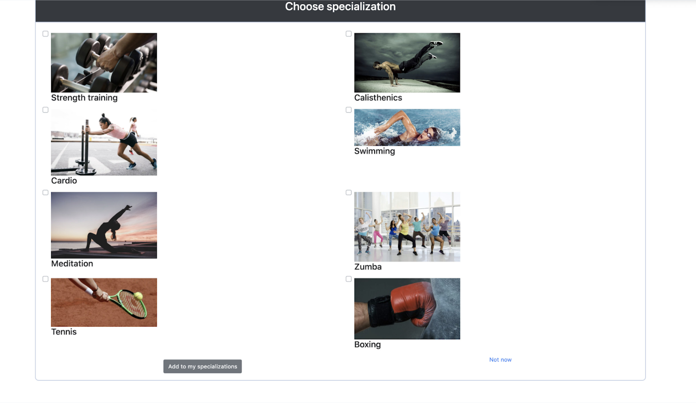
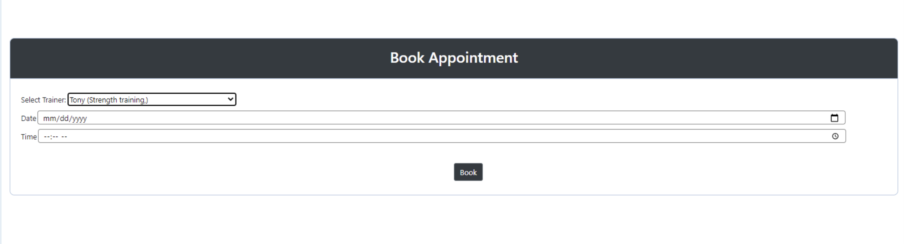
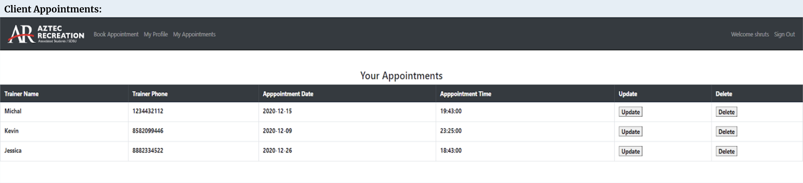
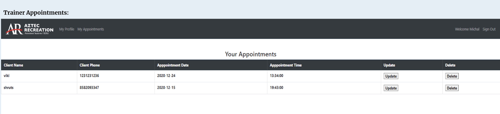
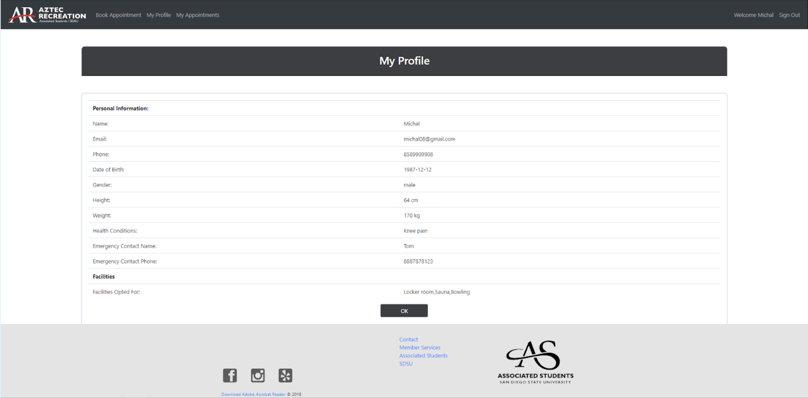

# Gym Appointment Management System

## Workflows
Register - Client/Trainer
Login - Client/Trainer
Client facilities opt in
Trainer specialization selection
Book Appointment - Create operation
View Appointments - Read operation
Update Appointment - Update operation
Delete Appointment - Delete operation
Client/Trainer Profile Page

## Technologies Used
MySQL
PHP
HTML5
CSS3
Twitter Bootstrap

## ER Diagram

## Database Tables
Client(cid, name, email, password, phone, birthdate, gender, height, weight, health_conditions, emergency_name, emergency_phone)
Trainer(tid, name, email, password, phone)
Specialization(id, type)
Facilities(fid, type)
Appointments(client_id, trainer_id, date,time)
OptedFor(client_id, facility_id)
SpecializesIn(trainer_id, specialization_id)

## Screenshots

## Assumptions
- A specialization is applicable for multiple trainers e.g. two trainers can teach kickboxing. So instead of using specialization as an attribute to the trainer which causes data redundancy, a separate relation is created for specialization
- Same applies to facilities for clients.
- One trainer can have multiple specializations and one client can opt for multiple facilities.

## Limitations
- A client and a trainer can have at most one appointment at a given point of time.
- There is no provision for the user to opt out from the facilities/specializations.
- There is no provision to add new facilities/specializations into the database.

